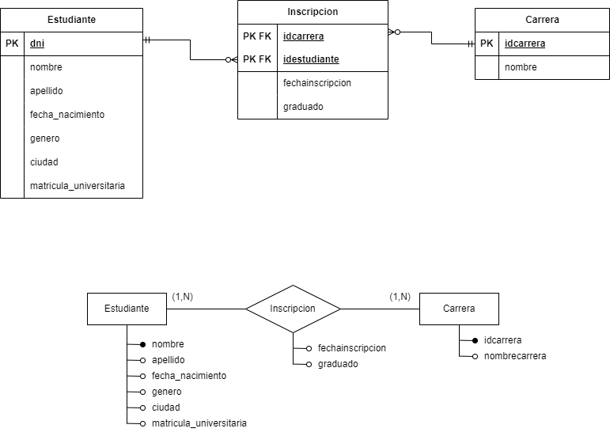

# Tp5Integrador-Diseno
Trabajo grupal sobre Microservicios para la materia Diseño de Sistemas de Software de Ing. en Sistemas (UNICEN).

En esta versión del proyecto, implementamos dos microservicios: consumidor y productor. Si bien esta versión tambien posee una sola base, esta solo es accedida por el consumidor, para evitar que los microservicios queden acoplados.

El productor es el encargado de los servicios REST que modifican la base (PUT y POST), es decir, esta es su unica responsabilidad y no podrá entregar al usuario datos de la base. Esta escritura la realiza mediante un mecanismo de eventos ya que no puede acceder directamente a la base."
El consumidor se encarga de tomar los eventos que el productor escribió y volcar los cambios en su base de datos. Además es el encargado de proveer al usuario los servios GET para obtener reportes de los datos.

## Datos del proyecto
El consumidor utiliza una base de datos que representa un sistema de inscripciones en una universidad con diferentes carreras. A continuación se encuentra el diagrama de Entidad Relación de dicha base.


## Microservicio Productor
## Endpoints

> POST http://localhost:8080/carreras/agregar
- Agregar una carrera
Este endpoint espera los datos de la carrera a agregar en el body de la request en el siguiente formato de ejemplo:
```json
{
   "type": "CarreraCreatedEvent",
  "idcarrera": 1,
  "nombre": "Ingeniería en Sistemas"
}
```
y puede devolver las siguientes respuestas:
- 200 OK Carrera agregada a Kafka con éxito
- 500 Internal Server Error: Error al guardar carrera + <mensaje de la excepción>

> POST http://localhost:8080/estudiantes/agregar
- Agregar un estudiante
Este endpoint espera los datos del estudiante a agregar en el body de la request en el siguiente formato de ejemplo:
```json
{
  "dniestudiante": "41783588",
  "apellido": "Palas",
  "nombre": "Joaco",
  "libretaUniversitaria": "248904",
  "genero": "H",
  "fechaNacimiento": "1999-04-30",
  "ciudad": "Mar del Plata"
}
```
y puede devolver las siguientes respuestas:
- 200 OK Estudiante agregado a Kafka con exito
- 500 Internal Server Error: Error al guardar estudiante + <mensaje de la excepción>

> PUT http://localhost:8080/estudiantes/modificarEstudiante
- Modificar un estudiante
Este endpoint espera los datos del estudiante actualizados en el body de la request en el siguiente formato de ejemplo:
```json
{
  "dniestudiante": "41783588",
  "apellido": "Palas",
  "nombre": "Joaco",
  "libretaUniversitaria": "248904",
  "genero": "H",
  "fechaNacimiento": "1999-04-30",
  "ciudad": "Mar del Plata"
}
```
y puede devolver las siguientes respuestas:
- 200 OK Estudiante agregado a Kafka con exito
- 500 Internal Server Error: Error al guardar estudiante + <mensaje de la excepción>

> POST http://localhost:8080/inscripciones/agregarInscripcion/{dniEstudiante}/{idCarrera}
- Agregar una inscripcion
Este endpoint espera el dni del estudiante a inscribir y el id de la carrera como path variables y puede devolver las siguientes respuestas:
- 200 OK Inscripcion agregada a Kafka con exito
- 500 Internal Server Error: Error al guardar estudiante + <mensaje de la excepción>

> PUT http://localhost:8080/inscripciones/actualizarGraduado/{dniEstudiante}/{idCarrera}
- Registra la graduacion de un estudiante de una carrera
Este endpoint espera el dni del estudiante que se gradua y el id de la carrera como path variables y puede devolver las siguientes respuestas:
- 200 OK Inscripcion a actualizar agregada a Kafka con éxito
- 500 Internal Server Error: Error al enviar actualizacion de la inscripcion + <mensaje de la excepción>


## Microservicio Consumidor

## Endpoints
> GET http://localhost:8081/carreras/informeInscriptos
- Recuperar las carreras y ordenarlas por cantidad de inscriptos.
Este endpoint puede devolver las siguientes respuestas:
- 200 OK
```json
[
    {
        "idCarrera": 1,
        "nombreCarrera": "Ingeniería en Sistemas",
        "cantidadInscriptos": 300
    },
    {
        "idCarrera": 2,
        "nombreCarrera": "Ingeniería Civil",
        "cantidadInscriptos": 250
    }
]
```
- 500 Internal Server Error: []


> GET http://localhost:8081/estudiantes/estudiantesDeCarreraXApellido/{idCarrera}
- Recuperar los estudiantes de una carrera en especifico y los ordena por apellido. El id de la carrera se espera como parametro en el path.
Este endpoint puede devolver las siguientes respuestas:
- 200 OK
```json
[
   {
        "dniestudiante": "41783589",
        "apellido": "Delgado",
        "nombre": "Lucia",
        "libretaUniversitaria": "248604",
        "genero": "M",
        "fechaNacimiento": "2001-04-30",
        "ciudad": "Mar del Plata"
    },
    {
        "dniestudiante": "41783588",
        "apellido": "Palas",
        "nombre": "Joaquin",
        "libretaUniversitaria": "248904",
        "genero": "H",
        "fechaNacimiento": "1999-04-30",
        "ciudad": "Mar del Plata"
    }
]
```
- 500 Internal Server Error: []

> GET http://localhost:8081/estudiantes/estudiantePorDNI/{dni}
- Recuperar un estudiante cuyo dni es el que se especifica por path variable.
Este endpoint puede devolver las siguientes respuestas:
- 200 OK
```json
[
   {
        "dniestudiante": "41783589",
        "apellido": "Delgado",
        "nombre": "Lucia",
        "libretaUniversitaria": "248604",
        "genero": "M",
        "fechaNacimiento": "2001-04-30",
        "ciudad": "Mar del Plata"
    }
]
```
- 500 Internal Server Error: []

> GET http://localhost:8081/estudiantes/estudiantePorLibreta/{LU}
- Recuperar un estudiante cuya libreta universitaria es la que se especifica por path variable.
Este endpoint puede devolver las siguientes respuestas:
- 200 OK
```json
[
   {
        "dniestudiante": "41783589",
        "apellido": "Delgado",
        "nombre": "Lucia",
        "libretaUniversitaria": "248604",
        "genero": "M",
        "fechaNacimiento": "2001-04-30",
        "ciudad": "Mar del Plata"
    }
]
```
- 500 Internal Server Error: []

> GET http://localhost:8081/inscripciones/informeIncriptosYEgresadosPorAnioCarrera
- Obtener el numero de inscriptos y el numero de egresador por año de una carrera ordenadas por cantidad de egresados.
Este endpoint puede devolver las siguientes respuestas:
- 200 OK
```json
[
    {
        "nombreCarrera": "Ingeniería en Sistemas",
        "anioInscripcion": 2024,
        "inscriptos": 300,
        "egresados": 39
    },
    {
        "nombreCarrera": "Ingeniería Civil",
        "anioInscripcion": 2024,
        "inscriptos": 80,
        "egresados": 40
    }
]
```
- 500 Internal Server Error: []
